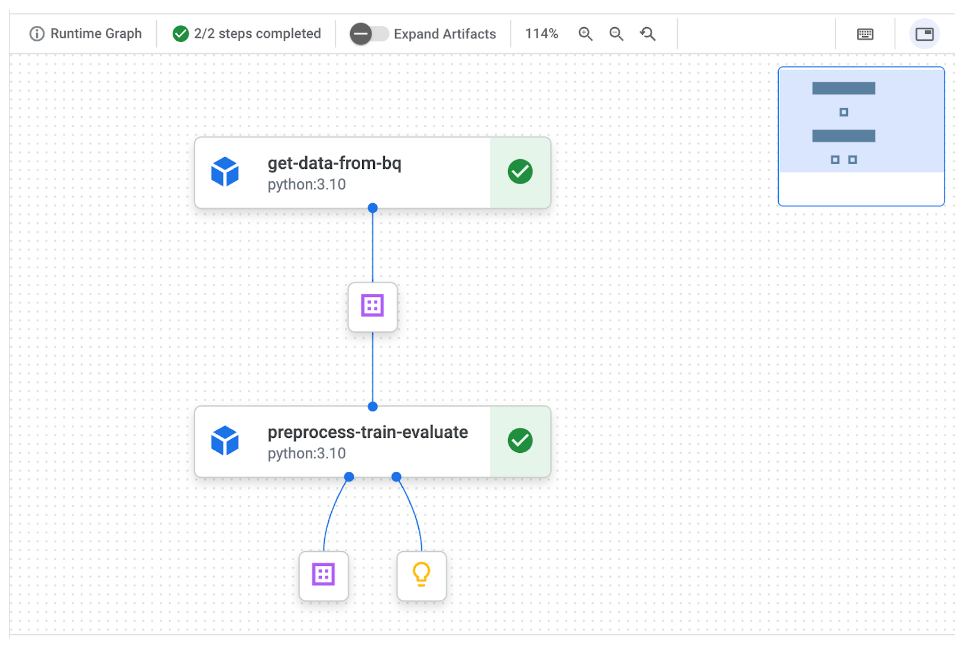

# MameLand_vol3
まめランドVol3用(競馬分析を行う)のGithubレポジトリです。

# horse_racing_strategy
## システム構成図
- レース結果取得 (MON 00:00)
    
- レース結果取得で追加したデータを加えた全データでのMLモデル再学習 (TUE 00:00) 
- 
- レース出走表取得 (SAT 00:00) 及び MLモデル予測実行 (各レース出走直前)

## データ更新フロー
### 週次モデル更新
scraping-race_results実行 (ジョブトリガー: Cloud SchedulerによるHTTPTSリクエスト): 月曜0時
実行結果は、GCSバケット「race_results_landing」へcsv出力
bq_uploader実行

## データソース
- ネット競馬  
出走馬の詳細情報確定時刻: 毎週金曜16:00  
枠順確定: レース前日の11時頃  
調教タイム: レース前日16時頃  
厩舎コメント: レース前日16時頃  
race_id取得  
過去レース: result.html  
未来レース: shutuba.html  

## Google Cloud 仕様

- リージョン
あれば：“US”（マルチリージョン）  
なければ：us-west1（オレゴン） ∵ 東京に最も近い無料枠付きusリージョン  
GCF: race_resultsスクレイピング  
実行時間が9 min超えるため、GCF第2世代かつHTTPトリガー必須。  
https://cloud.google.com/functions/docs/configuring/timeout?hl=ja  

## ランニングコスト  
Cloud Scheduler
	$0.10 (/Job/month) * {3 (会場) * 12 (レース) * 8 (days)} (Jobs) * 2 (days) / 30 (days)
	= 約$2.0

## 用語集
出走時刻: post time  
出走表: race card  
